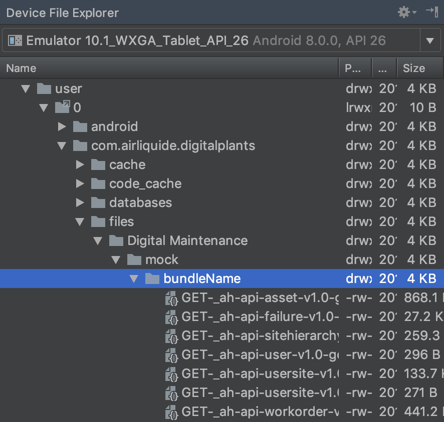
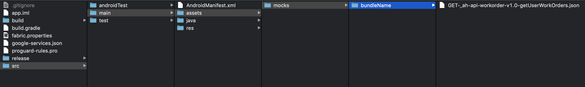

# ddf-echo-android

## add echo to your app

in your settings.gradle add
```
include ':echo'
project(':echo').projectDir = new File(settingsDir, 'absolute/or/relative/path/to/mockablelib')
```

then in your build.gradle (app) in section *dependencies* add this line 
```
implementation project(':echo')
```

**use Gradle Sync**


## How to Use ?

Config the lib
==============
```
val okHttpBuilder: OkHttpClient.Builder = OkHttpClient.Builder()
okHttpBuilder.setupMock(applicationContext,
       "bundleName",
       true,
       false);
```

- param1 : the application context
- param2 : (default = "") the bundle name => record/read in separate mock folder (for example record json files for user1 in separate bundle named user1 and then user2 in bundle user2, or each Retrofit client can have it's separate bundle)
- param3 : (default = false) recordEnable => when you want to save json files
- param4 : (default = false) useMockEnable => when you want to use json files

<span style="color:red">**you can't record and use mock at same times !!!**</span>


Mocks files nomenclature
========================

Example :

network call GET https://mydomain.com/_ah/api/user/v1.0/getUser

will create file named :

GET-_ah-api-user-v1.0-getUser.json

Record Json file
==================

When setup echo lib with parameter recordEnable to **true** then every network calls in Json file to your internal app files folder :




Mock WS with json files
=======================

When setup echo lib with parameter useMockEnable to **true** then every network calls try to find the associated file (related by name) in the assets folder (and bundle folder if setup)



If not found it try to find the file in Internal app files folder

If not found, it execute the orginal network call.