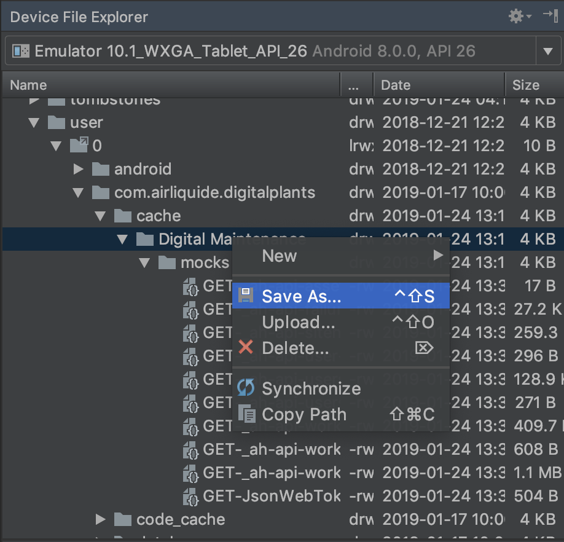
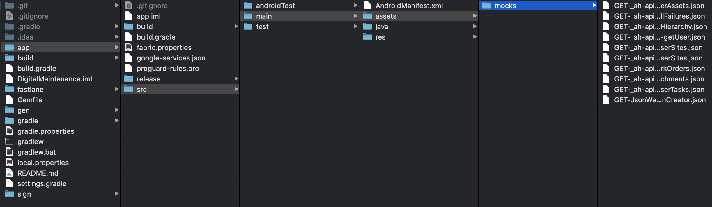

# ddf-mockablelib-android

## add mockablelib to your app

in your settings.gradle add
```
include ':mockablelib'
project(':mockablelib').projectDir = new File(settingsDir, 'absolute/or/relative/path/to/mockablelib')
```

then in your build.gradle (app) in section *dependencies* add this line 
```
implementation project(':mockablelib') 
```

**use Gradle Sync**


## How to Use ?

Config the lib
==============
```
Config.INSTANCE.setup(
    BuildConfig.RECORD_MOCKS,
    BuildConfig.FLAVOR.equals("mock"),
    ""
);
```

mock WS with json files
=======================

Create productFlavor named **mock**

Add interceptor to your OkHttpClient.Builder when you build your retrofit API.

Then when you use the application with build Variant mock and you use for example the WS declared like that in the ApiService of retrofit :
```
@GET("_ah/api/user/v1.0/getUser") Single<UserLoginDto> login(@Query("email") String email);
```

The MockNetworkInterceptor will try to find the file **GET-_ah-api-user-v1.0-getUser.json** in your app assets folder (app/src/main/assets).
If not found, it execute the orginal network call.


generate Json file
==================

Add **ScrapingNetworkInterceptor** once to your OkHttpClient.Builder when you build your retrofit API.

And then just go everywhere in app to call every WS, this will save every call of WS in Json file to your device app cache folder.

Then you can find and export all mocks files by exporting device folders :



Then to use mock BuildVariant copy mocks folder to app assets folder like this :


